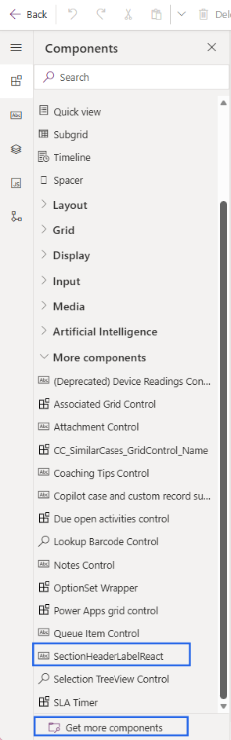
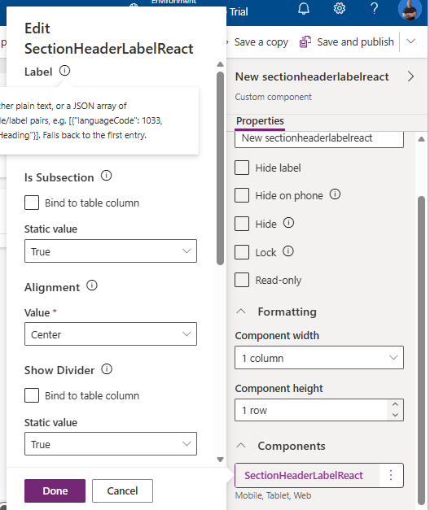
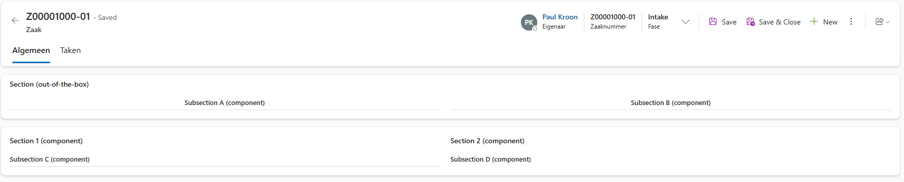

[← Back to main README](../README.md)

# 🔽 SectionHeaderLabelReact

A PowerApps Component Framework (PCF) control that renders a section/subsection heading label for Model-Driven App forms, built with React and Fluent UI. It supports optional text alignment, a bottom divider, top margin spacing, and multi-language labels.

## Features

- Displays a label component inside a form section as replacement of the out-of-the-box Section Label.
- Optional 
    - subsection (slightly smaller font) via `IsSubsection`.
    - Text alignment: left, center, or right.
    - horizontal divider below the label with a configurable color.
    - top margin for spacing (use when creating a subsection).
    - Localized labels: provide either plain text or a JSON array of `{ languageCode, label }` pairs, resolved against the current user's language at runtime (falling back to the first entry if no exact match is found). See Localized Label example

## Properties

| Property | Type | Required | Default | Description |
|---|---|---|---|---|
| `Label` | Multiple (text) | Yes | `[{"languageCode": 1033, "label": "My Heading"}]` | Label text. Either plain text, or a JSON array of `languageCode`/`label` pairs, e.g. `[{"languageCode": 1033, "label": "My Heading"}]`. Falls back to the first entry if the user's language isn't listed. |
| `IsSubsection` | Two Options | No | `false` | When `true`, reduces the label font size by 1px to indicate a subsection heading. |
| `Alignment` | Enum (`Left`/`Center`/`Right`) | Yes | `left` | Text alignment for the label. |
| `DividerShow` | Two Options | No | `false` | Shows a horizontal divider beneath the label. |
| `DividerColor` | Single Line Text | No | `#e0e0e0` | Color used for the divider's border-top. |
| `MarginTop` | Two Options | No | `false` | Adds a fixed 4px top margin above the label container. |

### Localized label example

```json
[
    { "languageCode": 1033, "label": "English Heading" },
    { "languageCode": 1043, "label": "Dutch Heading" },
    { "languageCode": 1036, "label": "French Heading" },
    { "languageCode": 1040, "label": "Italian Heading" }
]
```

Paste this JSON (as a single line, or multi-line as shown) into the `Label` property. At runtime the control looks up the entry matching `context.userSettings.languageId`; if there's no exact match it uses the first entry in the array.

## Usage on a form

1. Build and import the control into your environment (see below), or add it to a solution and import the solution.
2. Open the form in the form designer.
3. Add the component through the 'components' tab. See image below.
4. Insert the `SectionHeaderLabelReact` control as a component inside that section, above the fields it should label.
5. Set the `Label` property (plain text or the localized JSON format above).
6. Configure `Alignment`, `IsSubsection`, `DividerShow`, `DividerColor`, and `MarginTop` as needed.
7. Save and publish the form.

> Note: the control declares an unused bound property (`NotUsedProperty`) purely so the form designer allows it to be placed and configured as a form component, instead of it only be available through the classic interface - without editable properties -. It has no effect on behavior and can be left unset.



8. To change the properties, select the control, go to Components and klik SectionHeaderLabelReact. See image below



## Control inside a form
